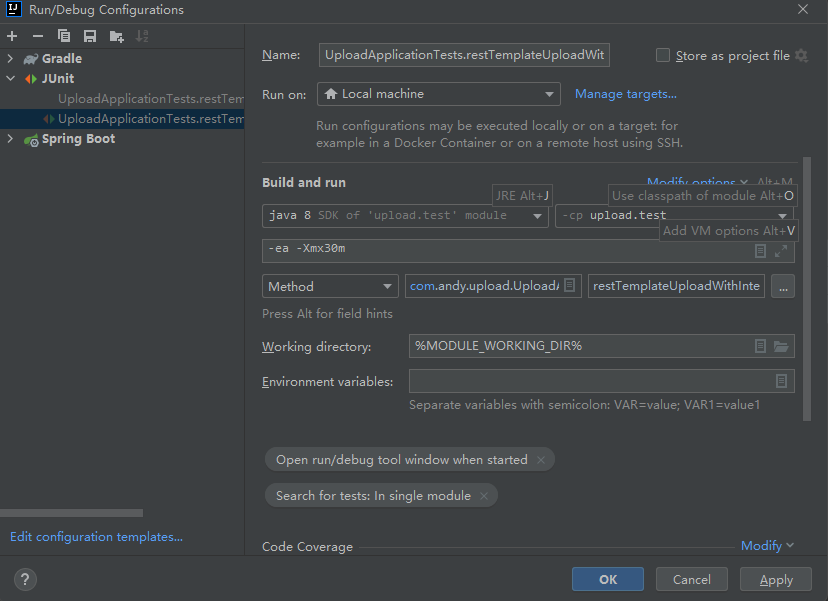

# Try to reproduce OutOfMemory Error with the following steps

## Run the UploadApplication as a file-upload server

## Run All UTs with limited memory (i.e. -Xmx=30m), the file to be uploaded is 50Mb

### Run the UT UploadApplicationTests.restTemplateUpload succeed
#### Upload a 50Mb file without buffered request body
### Run the UT UploadApplicationTests.restTemplateUploadWithInterceptor failed
#### Upload a 50Mb file without buffered request body, but with a BasicAuthenticationInterceptor
```java
Exception in thread "main" java.lang.OutOfMemoryError: Java heap space
	at java.util.Arrays.copyOf(Arrays.java:3236)
	at java.io.ByteArrayOutputStream.grow(ByteArrayOutputStream.java:118)
	at java.io.ByteArrayOutputStream.ensureCapacity(ByteArrayOutputStream.java:93)
	at java.io.ByteArrayOutputStream.write(ByteArrayOutputStream.java:153)
	at org.springframework.util.StreamUtils.copy(StreamUtils.java:167)
	at org.springframework.http.converter.ResourceHttpMessageConverter.writeContent(ResourceHttpMessageConverter.java:137)
	at org.springframework.http.converter.ResourceHttpMessageConverter.writeInternal(ResourceHttpMessageConverter.java:129)
	at org.springframework.http.converter.ResourceHttpMessageConverter.writeInternal(ResourceHttpMessageConverter.java:45)
	at org.springframework.http.converter.AbstractHttpMessageConverter.write(AbstractHttpMessageConverter.java:227)
	at org.springframework.http.converter.FormHttpMessageConverter.writePart(FormHttpMessageConverter.java:541)
	at org.springframework.http.converter.FormHttpMessageConverter.writeParts(FormHttpMessageConverter.java:517)
	at org.springframework.http.converter.FormHttpMessageConverter.writeMultipart(FormHttpMessageConverter.java:497)
	at org.springframework.http.converter.FormHttpMessageConverter.write(FormHttpMessageConverter.java:369)
	at org.springframework.http.converter.FormHttpMessageConverter.write(FormHttpMessageConverter.java:156)
	at org.springframework.web.client.RestTemplate$HttpEntityRequestCallback.doWithRequest(RestTemplate.java:991)
	at org.springframework.web.client.RestTemplate.doExecute(RestTemplate.java:774)
	at org.springframework.web.client.RestTemplate.execute(RestTemplate.java:711)
	at org.springframework.web.client.RestTemplate.postForObject(RestTemplate.java:437)
	at com.andy.upload.service.RestTemplateService.uploadLargeFile(RestTemplateService.java:34)
	at com.andy.upload.UploadApplicationTests.restTemplateUploadWithInterceptor(UploadApplicationTests.java:44)
	at sun.reflect.NativeMethodAccessorImpl.invoke0(Native Method)
	at sun.reflect.NativeMethodAccessorImpl.invoke(NativeMethodAccessorImpl.java:62)
	at sun.reflect.DelegatingMethodAccessorImpl.invoke(DelegatingMethodAccessorImpl.java:43)
	at java.lang.reflect.Method.invoke(Method.java:498)
	at org.junit.platform.commons.util.ReflectionUtils.invokeMethod(ReflectionUtils.java:688)
	at org.junit.jupiter.engine.execution.MethodInvocation.proceed(MethodInvocation.java:60)
	at org.junit.jupiter.engine.execution.InvocationInterceptorChain$ValidatingInvocation.proceed(InvocationInterceptorChain.java:131)
	at org.junit.jupiter.engine.extension.TimeoutExtension.intercept(TimeoutExtension.java:149)
	at org.junit.jupiter.engine.extension.TimeoutExtension.interceptTestableMethod(TimeoutExtension.java:140)
	at org.junit.jupiter.engine.extension.TimeoutExtension.interceptTestMethod(TimeoutExtension.java:84)
	at org.junit.jupiter.engine.descriptor.TestMethodTestDescriptor$$Lambda$115/776700275.apply(Unknown Source)
	at org.junit.jupiter.engine.execution.ExecutableInvoker$ReflectiveInterceptorCall.lambda$ofVoidMethod$0(ExecutableInvoker.java:115)
```